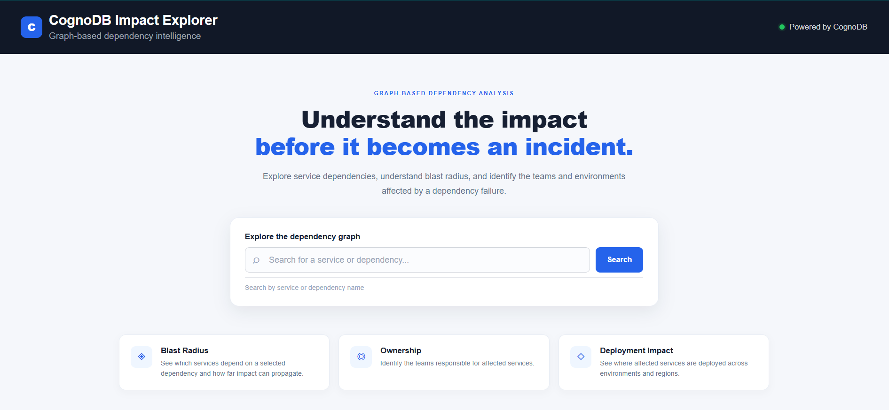
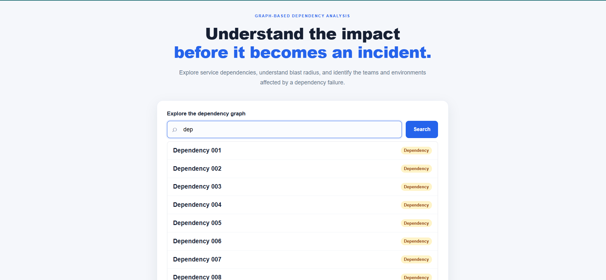
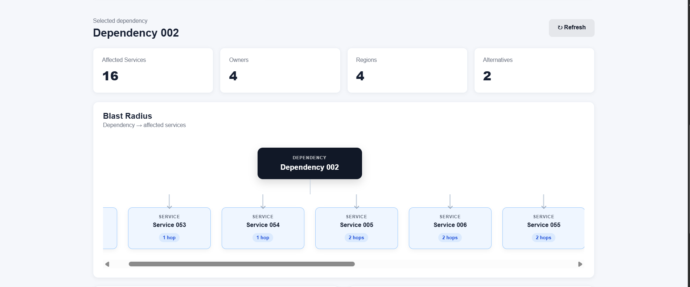
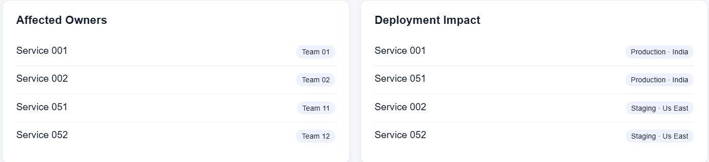
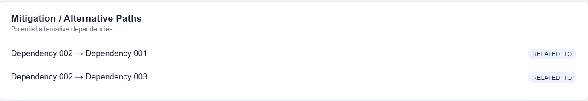
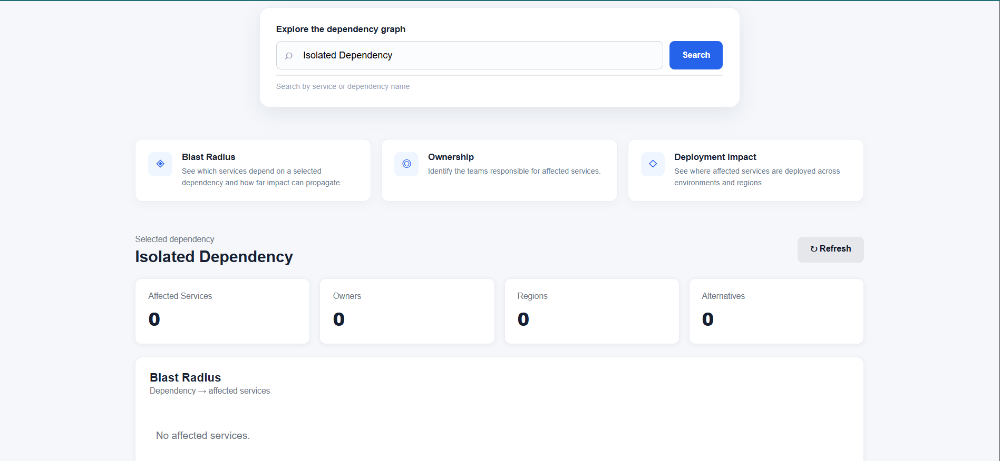
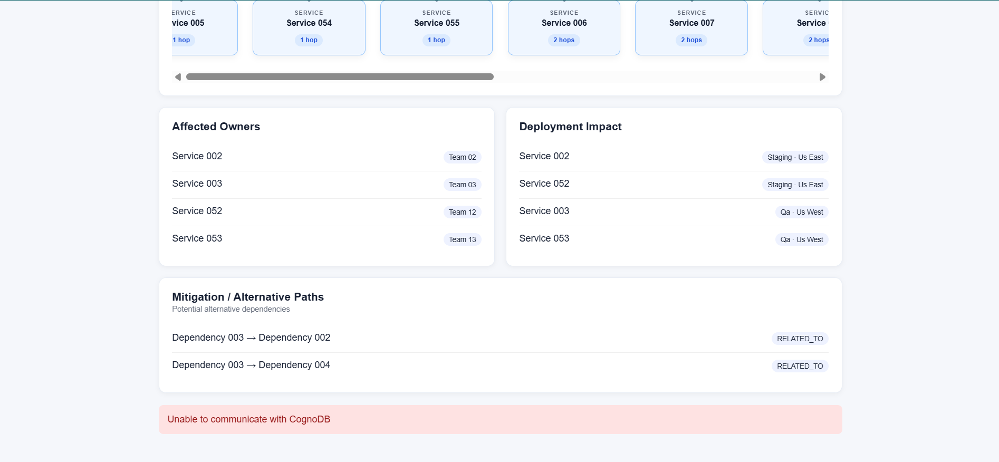

# Supply-Chain Impact Explorer

A graph-powered dependency intelligence tool for exploring how a dependency failure propagates through services, teams, environments, and regions.

## 🚀 Live Demo

**[Open the live application](https://supply-chain-graph-explorer-production.up.railway.app/)**

The live deployment is backed by CognoDB and uses the large seeded graph dataset.

### What you can explore

- Search services and dependencies
- Trace multi-hop dependency impact
- Identify affected services
- Identify responsible teams
- Inspect affected environments and regions
- Discover alternative or mitigation paths

## Screenshots

### 1. Dashboard — Search
The entry point. A user searches for a service or dependency by name.



### 2. Search Results
Services and dependencies matching the query, ready for selection.



### 3. Impact Overview — Blast Radius
The core screen. Affected services grouped by hop distance from the
selected dependency.



### 4. Owners, Environments & Regions
Responsible teams and deployment footprint for the affected services.



### 5. Alternative / Mitigation Paths
Related dependencies that could serve as fallback options.



### 6. Empty State
Result when a dependency has no downstream impact.



### 7. Error State
Behavior when CognoDB is unreachable.



## Tech Stack

- **Java 21**
- **Spring Boot**
- **Spring MVC**
- **Thymeleaf**
- **Neo4j Java Driver**
- **CognoDB**
- **openCypher**
- **Docker**
- **Railway**
- **HTML / CSS / JavaScript**

## Problem

In a service-oriented system, a dependency failure rarely affects only the dependency itself.

A single unavailable dependency can propagate through multiple services and create a wider operational impact across:

- downstream services
- responsible teams
- deployment environments
- geographic regions
- alternative dependency paths

The difficult part is not storing these entities. The difficult part is understanding the relationships between them and answering questions such as:

> If this dependency becomes unavailable, which services are affected, how far does the impact propagate, which teams own those services, where are they deployed, and are there alternative paths?

CognoDB Impact Explorer models these relationships as a graph and uses graph traversal to answer these questions.

## Why a Graph Database?

The core problem is relationship-heavy.

A dependency can affect a service, which can affect another service, which can be deployed in an environment, which runs in a region, while each affected service is owned by a team.

Conceptually, the traversal looks like:

```text
Dependency
    ↓
Service
    ↓
Service
    ↓
Environment
    ↓
Region

```

with ownership and alternative paths attached to the graph.

In a relational design, answering the same questions would require repeatedly joining dependency, service, ownership, deployment, environment, region, and mitigation tables.

A graph database represents these relationships directly.

This makes multi-hop traversal a first-class operation rather than reconstructing the relationship network through repeated relational joins.

### What the graph enables

The application can answer:

1. Which services directly depend on a dependency?
2. Which downstream services can be affected across multiple hops?
3. Which teams own those services?
4. Which environments and regions are affected?
5. Are there alternative or mitigation paths?

These are graph traversal questions, which makes a graph-oriented data model a natural fit.

## Why CognoDB?

CognoDB is a graph database designed for relationship-centric applications and supports querying graph data using openCypher.

It fits this project because the core operations are graph traversals rather than simple record lookups. The application needs to follow relationships between dependencies and services, traverse downstream services across multiple hops, and then retrieve related ownership, deployment, regional, and alternative-path information.

The application communicates with CognoDB using the Neo4j Java Driver over the Bolt protocol. This allows the Spring Boot backend to execute parameterized Cypher queries directly against the graph.

### Why not a relational database?

A relational database could represent the same entities using tables and foreign keys. However, the primary operations in this application are relationship traversals:

- Find services affected by a dependency.
- Traverse downstream dependencies across multiple hops.
- Identify owners of affected services.
- Determine affected environments and regions.
- Find alternative dependency paths.

With a relational approach, these operations would require repeatedly joining relationship tables as traversal depth increases.

With a graph database, the relationships are represented directly as edges in the graph, and Cypher can express the traversal more naturally.

For example, the blast-radius query can start at a dependency and traverse downstream service relationships up to a defined depth:

Dependency → Service → Service → Service

The resulting services form the dependency's potential blast radius.

## Architecture

The application follows a simple layered architecture:

```text
┌──────────────────────────────┐
│          Web UI              │
│   Thymeleaf + JavaScript     │
└──────────────┬───────────────┘
               │ HTTP / JSON
               ▼
┌──────────────────────────────┐
│      Spring Boot API         │
│                              │
│  GraphController             │
│          ↓                   │
│  GraphService                │
│          ↓                   │
│  GraphRepository             │
└──────────────┬───────────────┘
               │
        Neo4j Java Driver
               |
           Bolt protocol
               │
               ▼
┌──────────────────────────────┐
│          CognoDB             │
│                              │
│  Services                    │
│  Dependencies                │
│  Teams                       │
│  Environments / Regions      │
│  Relationships               │
└──────────────────────────────┘
```
## Request flow

### A typical request follows this path:

- The user searches for a service or dependency through the web UI.
- The frontend sends an HTTP request to the Spring Boot REST API.
- GraphController receives the request and delegates the operation to GraphService.
- GraphService coordinates the required graph operations.
- The repository layer executes parameterized Cypher queries through the Neo4j Java Driver.
- CognoDB performs the graph traversal and returns the results.
- The backend converts the results into JSON.
- The frontend uses the response to update the interface.

This separation keeps HTTP handling, application logic, and graph queries independent from each other.

## Graph Model

The application models the supply-chain dependency landscape as a connected graph.

```text

                             ┌─────────────┐
                             │    Team     │
                             └──────┬──────┘
                                    │ OWNED_BY
                         DEPENDS_ON │ (reverse: Service → Team)
                                    │
┌─────────────┐                     ▼
│ Dependency  │              ┌─────────────┐
|             | ───────────► |             |
│             │              │   Service   │
│ id: string  │◄───────────  │             │
│ name        │ RELATED_TO   │  id: string │
│ tier        │ (alt path)   │      name   │
└─────────────┘              └──────┬──────┘
                                    │
                         DEPLOYED_IN│
                                    ▼
                             ┌─────────────┐
                             │  Environment│
                             │   name      │
                             │   (Prod/    │
                             │   Sandbox)  │
                             └──────┬──────┘
                                    │ RUNS_ON
                                    ▼
                            ┌─────────────┐
                            │   Region    │
                            │    name     │
                            └─────────────┘

Legend:
  (Dependency)-[:DEPENDS_ON]->(Service)        service consumes a dependency
  (Service)-[:DEPENDS_ON]->(Service)           downstream service dependency
  (Service)-[:OWNED_BY]->(Team)                ownership
  (Service)-[:DEPLOYED_IN]->(Environment)      deployment context
  (Environment)-[:RUNS_ON]->(Region)           geographic placement
  (Dependency)-[:RELATED_TO]->(Dependency)     alternative / mitigation path
```

### Nodes

| Node | Description |
|---|---|
| `Service` | An application or service that participates in the dependency chain. |
| `Dependency` | An external or shared component that services depend on. |
| `Team` | The team responsible for a service. |
| `Environment` | The deployment environment, such as Production or Sandbox. |
| `Region` | The geographic region where a service is deployed. |

### Relationships

The graph connects these entities through relationships representing dependency, ownership, and deployment information.

At the core of the model is the dependency chain:

```text
                    ┌───> Team
                    │
Dependency → Service ───> Environment
                    │          │
                    │          ▼
                    │        Region
                    │
                    └───> Downstream Service
```
This structure allows the application to traverse the dependency graph and then associate the affected services with their owners, deployment environments, regions, and alternative dependencies.

### Graph Traversal

For blast-radius analysis, the application starts from a selected dependency and follows downstream service relationships up to a defined number of hops.

```text
Dependency 001
      │
      ▼
Service 001       hop 0
      │
      ▼
Service 002       hop 1
      │
      ▼
Service 003       hop 2
      │
      ▼
Service 004       hop 3
```
The resulting services represent the potential impact of the dependency failure.

The application then enriches this impact set with ownership, deployment-region, environment, and alternative-path information.

## Core Cypher Queries

The application uses parameterized Cypher queries to perform the main graph operations.

### 1. Search

Searches both `Service` and `Dependency` nodes by name.

```cypher
MATCH (n)
WHERE (n:Service OR n:Dependency)
  AND toLower(n.name) CONTAINS toLower($query)
RETURN n.id AS id,
       CASE
           WHEN n:Service THEN 'Service'
           WHEN n:Dependency THEN 'Dependency'
       END AS type,
       n.name AS name
ORDER BY n.name
LIMIT 20
```

The query allows the UI to search across both services and dependencies using a single endpoint.

### 2. Dependency Traversal / Blast Radius

Starting from a dependency, the application traverses downstream service relationships up to three hops.

The traversal identifies the services that can potentially be affected by the dependency.

```text
Dependency
    ↓
Service
    ↓
Service
    ↓
Service
```
The result includes the affected service and its calculated hop distance.

### Why this query is awkward in a relational database

The blast-radius query has no fixed depth — a dependency might affect
one service or five, three hops deep or one, depending on how the
graph happens to be shaped. In Cypher this is a single variable-length
pattern:

​```cypher
MATCH (d:Dependency {id: $dependencyId})-[:DEPENDS_ON*1..3]->(s:Service)
RETURN DISTINCT s, length(path) AS hops
​```

In a relational schema, the same question requires either:

- A fixed number of self-joins on a `service_dependencies` table, one
  join per hop — which only works if you decide the max depth in
  advance and hard-code that many joins, or
- A recursive CTE, which most relational engines support but which
  scales poorly and reads far less naturally than a bounded graph
  traversal.

Because the depth of impact is exactly the thing you don't know in
advance when an incident starts, expressing "how far does this
propagate" as a first-class, depth-flexible query — rather than a
fixed join chain — is the core advantage a graph database provides
here.

### 3. Affected Owners

Once the affected services are identified, the graph is traversed through ownership relationships to determine the responsible teams.
```text
Affected Service ──OWNED_BY──> Team
```

### 4. Affected Regions

The application follows deployment relationships to determine where affected services are running.

```text
Service
   ↓
Environment
   ↓
Region
```

This allows the application to distinguish impacts such as Production vs. Sandbox and regional deployment differences.

### 5. Alternative Dependencies

The graph also models relationships between dependencies that can represent alternative or related paths.

```text
Dependency 001 ──RELATED_TO──> Dependency 002
```

The application exposes these relationships as potential alternatives or mitigation paths.

### 6. Aggregated Overview

The overview operation combines the graph analysis into a single response containing:

- Affected services and hop distance
- Responsible teams
- Affected environments and regions
- Alternative dependencies

This allows the frontend to retrieve the complete impact analysis with a single API request.

## REST API

The backend exposes a small REST API under `/api/graph`.

| Method | Endpoint | Purpose |
|---|---|---|
| `GET` | `/api/graph/search?q={query}` | Search for services and dependencies |
| `GET` | `/api/graph/dependencies/{serviceId}` | Retrieve dependencies associated with a service |
| `GET` | `/api/graph/blast-radius/{dependencyId}` | Calculate the downstream impact of a dependency |
| `GET` | `/api/graph/owners/{dependencyId}` | Find teams associated with affected services |
| `GET` | `/api/graph/regions/{dependencyId}` | Find affected environments and regions |
| `GET` | `/api/graph/alternatives/{dependencyId}` | Find alternative or related dependencies |
| `GET` | `/api/graph/overview/{dependencyId}` | Return the complete dependency impact analysis |

### Aggregated Overview

The primary UI workflow uses the overview endpoint:

```text
GET /api/graph/overview/{dependencyId}
```

The response combines the results of the graph analysis into a single JSON document:

```json
{
  "target": "dependency:dep-001",
  "affectedServices": [],
  "owners": [],
  "regions": [],
  "alternatives": []
}
```

This allows the frontend to render the complete impact analysis without making separate HTTP requests for each section.

### API Design

The controllers are intentionally thin. HTTP request handling is separated from the graph traversal and application logic:

```text
GraphController
      ↓
GraphService
      ↓
GraphRepository
      ↓
CognoDB
```

The graph-specific logic remains in Cypher queries rather than being embedded in the HTTP layer.

## UI Flow

The application is designed around a simple dependency-impact investigation workflow.

### 1. Search

The user begins by searching for a service or dependency.

```text
User
 ↓
Search bar
 ↓
GET /api/graph/search
 ↓
Services / Dependencies
```
The search results allow the user to identify the dependency or service they want to investigate.

### 2. Select a Dependency

After selecting a dependency, the application retrieves the dependency information associated with the selected item.

The user can then initiate an impact analysis.

### 3. Impact Analysis

The application requests the aggregated overview:
```
GET /api/graph/overview/{dependencyId}
```
The backend performs the required graph traversals against CognoDB and returns the complete analysis.

### 4. Explore the Impact

The UI presents the results in separate sections:

- **Affected Services** — services within the calculated blast radius and their hop distance.
- **Owners** — teams responsible for affected services.
- **Regions & Environments** — deployment locations and environments affected.
- **Alternatives** — related or alternative dependency paths.

This allows a user to move from a single dependency to an operational view of its potential impact without manually querying the graph.

## Seed Data & Database Initialization

The application uses a large Cypher seed script to populate the CognoDB graph with the services, dependencies, teams, environments, regions, and relationships required for the demonstration.

The seed script is located at:

```text
src/main/resources/scripts/seed-large.cypher
```

### Database Seeding

Database seeding is intentionally kept separate from the normal application startup flow.

The deployed Spring Boot application connects to the already-populated CognoDB instance and does not automatically execute the seed script on startup. This prevents the dataset from being re-created whenever the application restarts or is redeployed.

For reference, the project documentation contains an example SeedRunner implementation showing how the Cypher seed can be loaded from the application classpath and executed through the Neo4j Java Driver.

See the [Database Seeding Documentation](docs/database-seeding.md) for the implementation and initialization details.

The documented runner is intended as a development/reference approach for initializing a fresh database rather than as part of the production application startup path.

### Recommended Initialization Flow

For a fresh CognoDB instance:
```text
seed-large.cypher
       ↓
CognoDB
       ↓
Spring Boot application
       ↓
REST API / UI
```

## Local Development

### Prerequisites

- Java 21
- Maven
- Docker
- Access to a CognoDB instance
- Git

### 1. Clone the repository

```bash
git clone https://github.com/Jitbaul13-maker/supply-chain-graph-explorer.git
cd supply-chain-graph-explorer
```

### 2. Configure environment variables

Create a .env file for local development:
```text
COGNODB_URI=<your-cognodb-bolt-uri>
COGNODB_USERNAME=<your-cognodb-username>
COGNODB_PASSWORD=<your-cognodb-password>
```
The .env file is intentionally excluded from version control.

### 3. Populate CognoDB

For a fresh database, execute the provided seed-large.cypher dataset against CognoDB.

The documented SeedRunner example in Database Seeding Documentation demonstrates one way to execute the seed through the Neo4j Java Driver.

### 4. Run the application

The application can be started using Maven:

```bash
mvn spring-boot:run
```
If port 8080 is already occupied in the local environment, run the application on port 8081:
```bash
mvn spring-boot:run \
  -Dspring-boot.run.arguments="--server.port=8081" \
  -Dspring-boot.run.jvmArguments="-Djava.net.preferIPv4Stack=true -Djava.net.preferIPv4Addresses=true"
```
The application will then be available at:
```text
http://localhost:8081
```
### Running with Docker

The project also includes a Docker configuration for running the application as a container.
```bash
docker compose up --build
```
The Docker configuration uses the platform-provided PORT when available, while retaining 8081 as the local fallback.

### Environment Variables

The application reads the following variables from the environment:

| Variable | Purpose|
|----------|--------|
| COGNODB_URI |	CognoDB Bolt connection URI|
| COGNODB_USERNAME | CognoDB username|
| COGNODB_PASSWORD | CognoDB password|

Credentials should never be committed to the repository.

## Deployment

The application is containerized using Docker and deployed as a Spring Boot service on Railway.

### Deployment Architecture

```text
GitHub
   │
   │ push to main
   ▼
Railway
   │
   ▼
Docker build
   │
   ▼
Spring Boot application
   │
   ▼
CognoDB
```

### Environment Variables

Production credentials are not stored in the repository.

Railway provides the following environment variables to the application at runtime:
```text
COGNODB_URI
COGNODB_USERNAME
COGNODB_PASSWORD
```
The application reads these values from the environment and uses them to establish the Bolt connection to CognoDB.

### Port Configuration

Railway provides the application port through the PORT environment variable.

The Docker entrypoint uses the platform-provided port when available and falls back to port 8081 for local execution.

```text
Railway
  PORT → Spring Boot

Local
  PORT not set → 8081
```

### Continuous Deployment

The repository is connected to Railway through the Railway GitHub App.

Commits pushed to the configured main branch can therefore trigger a new deployment automatically.

## Project Structure

```text
src/
├── main/
│   ├── java/com/baul/cognoDBdemo/
│   │   ├── config/
│   │   │   └── CognoDbConfig.java
│   │   │
│   │   ├── controller/
│   │   │   ├── GraphController.java
│   │   │   └── PageController.java
│   │   │
│   │   ├── repository/
│   │   │   └── GraphRepository.java
│   │   │
│   │   ├── service/
│   │   │   └── GraphService.java
│   │   │
│   │   └── CognoDBdemoApplication.java
│   │
│   └── resources/
│       ├── scripts/
│       │   └── seed-large.cypher
│       │
│       ├── static/
│       │   ├── css/
│       │   └── js/
│       │
│       ├── templates/
│       │   └── index.html
│       │
│       └── application.properties
│
├── docs/
│   └── database-seeding.md
│
├── Dockerfile
├── docker-compose.yml
└── pom.xml
```

### Package Responsibilities

| Component | Responsibility |
|-----------|----------------|
| controller |	Handles HTTP requests and returns API/page responses |
| service |	Coordinates application and graph operations |
| repository |	Contains Cypher queries and communicates with CognoDB |
| config |	Creates and configures the CognoDB/Neo4j driver |
| templates |	Thymeleaf UI |
| static |	Frontend JavaScript and CSS |
| scripts |	Graph seed data |
| docs |	Development and database-seeding documentation |

## Engineering Decisions

### Graph-first data model

The application models the dependency landscape as a graph because the primary operations involve traversing relationships between services and dependencies.

Rather than reconstructing these relationships through multiple relational joins, the application uses Cypher to express the required traversals directly.

### Parameterized Cypher

Graph queries use parameters for user-supplied values instead of constructing Cypher strings through concatenation.

This keeps the query structure separate from input values and provides a safer and cleaner query interface.

### Layered backend

The application separates responsibilities across:

```text
Controller
    ↓
Service
    ↓
Repository
    ↓
CognoDB
```

This keeps HTTP handling, application orchestration, and graph-specific queries independent.

### Aggregated overview API

The UI primarily uses a single overview endpoint for dependency-impact analysis.

The backend combines the required graph operations into one response containing affected services, owners, regions, and alternatives.

This avoids forcing the frontend to make several separate requests to render one impact-analysis view.

### Production seeding is separated from application startup

The large graph dataset is initialized separately from the normal application startup lifecycle.

The documented SeedRunner demonstrates how the dataset can be loaded for development or fresh database initialization, while the deployed application connects to the existing populated CognoDB instance without reseeding it on every restart.

### Environment-based configuration

Database connection details are supplied through environment variables rather than being committed to source control.

This keeps local development configuration and production secrets separate from the application code.
